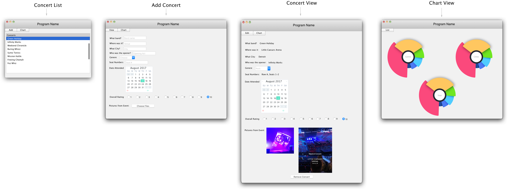
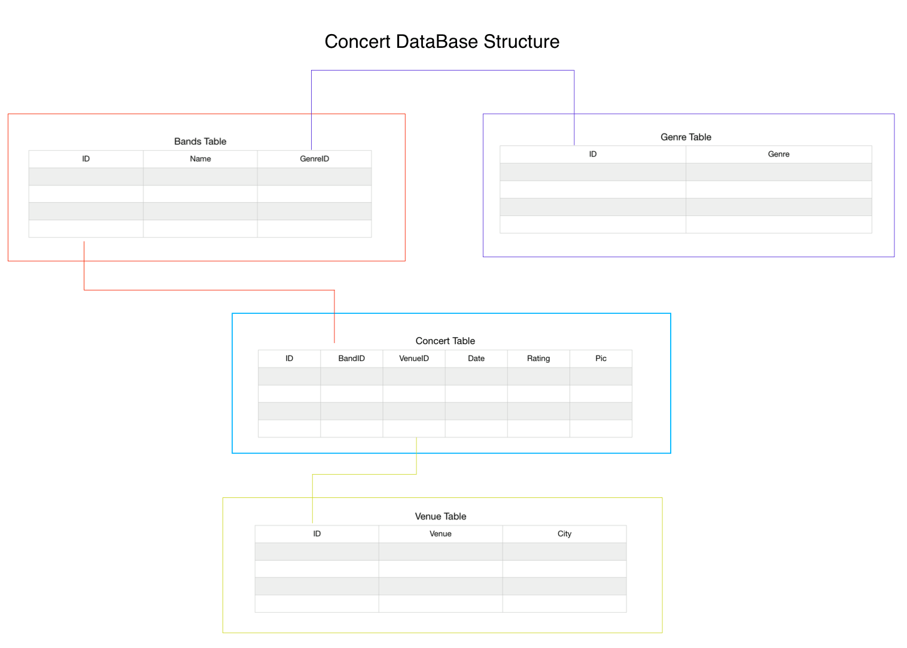

# JavaProject
Concert Tracker 

### **Designed GUI (Subject to change)**

### **Database Structure**

**When launching the program please use a local server (I.E XAMPP) or comment out the lines of code that call on the connection, 'localhost' and fill in Scweb and add your credentials. Lastly, please dont forget to create a database called JavaProject(Follow the naming scheme accordly)**

